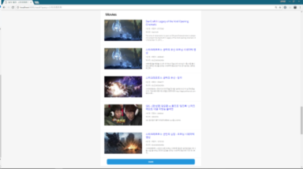

# 2017 한이음 위키워드 프로젝트

- Back-end : Node.js &nbsp;&nbsp; / &nbsp;&nbsp; Front-end : HTML5, CSS3, Vanilla.js
- 위키워드는 사용자가 입력한 검색어에 맞춰 위키피디아, 핀터레스트, 구글 이미지, 네이버 뉴스, 도서, 논문, 트위터 등 각종 서비스의 데이터를 크롤링 및 제공하는 Open-api를 활용하여 데이터를 종합 및 사용자에게 제공하는 서비스입니다.
<br/><br/>

## 제작 동기

- 한이음 프로젝트에서 크롤링을 주제로 아이디어를 고심하던 중 여러 서비스에서 필요 데이터를 모아 종합적으로 제공하는 서비스를 구현하기로 합의하고 팀원들과 함께 Node.js 기반 위키워드 프로젝트를 진행. 
<br/><br/>

## UI

 &nbsp;&nbsp;


 &nbsp;&nbsp;


<br/><br/>
 &nbsp;&nbsp;
 &nbsp;&nbsp;
 &nbsp;&nbsp;

 &nbsp;&nbsp;
 &nbsp;&nbsp;
 &nbsp;&nbsp;
<br/><br/>

## Install

### 1. 프로젝트 clone 후 node dependency 설치 ( [Node.js](https://nodejs.org/en/) 설치가 반드시 되어 있어야 한다. )
```
 git clone https://github.com/hanium2017/Wikiword.github.com
 cd Wikiword
 npm install    
```

### 2. common 폴더로 이동 후 wikiword.json 파일에 필요 api_key 및 서버 ip, 포트를 셋팅한다.
```
 cd common
```

### 3. 실행한다.
```
 npm start (forever) or npm test (nodemon)
```

## 제작자
- [윤태영](https://github.com/yung6699) ( Back-end 개발 및 Server 구축)
- [진영균](https://github.com/ywnwalone) ( Front-end 개발 및 UI 디자인 )
- [조용진](https://github.com/drake-jin) ( DB 설계, 구조 설계 )
- [최명순](https://github.com/reason1241) ( Back-end 개발 )
- [박상언](https://github.com/Caicell) ( 팀장, 프로젝트 관리 )
- [김학수](https://github.com/haksuuuuuu) ( UI 디자인 )


